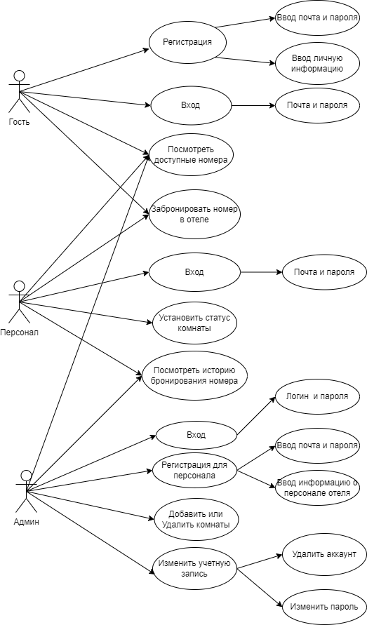
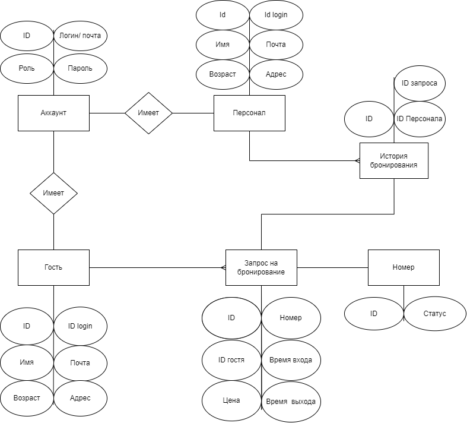
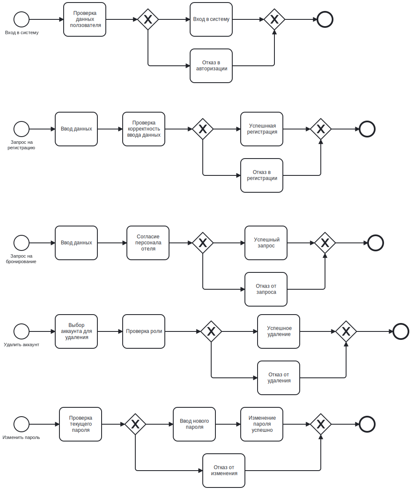

# Проектирование программного обеспечения

## 1.Название проекта
Приложение для бронирования отелей.
## 2.Краткое описание идеи проекта
Создать приложение, позволяющее осуществлять бронирование отелей. В котором клиент может просмотреть доступные номера в отеле и забронировать, персонал отеля может одобрить запрос на бронирование.
## 3.Краткое описание предметной области
Предметная область - система бронирования отелей: реализация запросов клиентов на бронирование, управление статусом номеров, запись истории бронирования.

## 4.Краткий анализ аналогичных решений
Имя приложения|Тип приложения|Рабочий диапазон|Тип отеля|Другое использование
---|---|---|---|---
My Vinpearl|Локальное\Веб приложение|Вьетнам|Высокое качество, высокая цена|Управляйте расписанием поездок
Traveloka|Онлайн-платформа|Вьетнам|Дешевый отель|Бронирование авиабилетов, аренда автомобиля
Booking.com|Локальное\Веб приложение|Глобальный|Отели во всех ценовых категориях|Инструмент сравнения цен на гостиничные номера
Vntrip|Локальное\Веб приложение|Вьетнам|Сегмент бюджетных и средних отелей|Собственный инструмент для сравнения цен на номера и авиабилеты

## 5.Краткое обоснование целесообразности и актуальности проекта
`Актуальность`: Поскольку все больше и больше людей хотят путешествовать, крайне необходимо и полезно иметь приложение, которое может быстро бронировать номера в отелях.

`Целесообразность`: Приложения интерактивных баз данных не только обеспечивают информационную безопасность, надежность, удобство и простоту, но и предоставляют возможность обновления для удовлетворения других потребностей клиентов отеля.
## 6.Use-Case - диаграмма

## 7.ER-диаграмма сущностей

## 8.Пользовательские сценарии
`Гость` имеет возможность просмотреть свободные номера в гостинице, сделать заявку на бронирование.

`Персонал` имеет возможность просматривать списки номеров, одобрять запросы на бронирование, устанавливать статус номера, просматривать историю бронирований.

`Админ` имеет возможность просматривать списки номеров, просматривать историю бронирований, добавлять/удалять номер, добавлять/удалять аккаунт, изменять пароль аккаунта.

### Сценарий:
1.Гость доступ к приложению. Информация о госте добавляется в базу данных.

2.Гость просматривает информацию о свободных номерах, ценах и оформляют бронирование. Запрос на бронирование будет отправлен в систему.

3.Персонал отеля рассматривает запросы на бронирование. Утверждайте или отклоняйте запросы на бронирование. Персонал отеля опирается на время прибытия и отъезда гостей, чтобы установить статус номера.

## 9.Формализация бизнес-правил

## 10.Тип приложения и технологического стека
Тип приложения - Desktop App

Технологический стек
- backend & frontend - C#
- БД - PostgreSQL

## 11.Верхнеуровневое разбиение на компоненты

